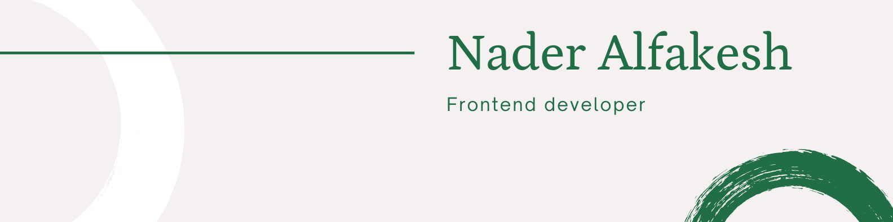

### Hello My name is Nader Alfakesh 👋

I work as a frontend developer for a SAAS startup in Istanbul, Turkey.
I have a passion for programing especially frontend development, Recently I am focused on mobile development with react native and I love it.
I am trying to get more involved in open source community hoping that I can add real value to inspiring projects.

